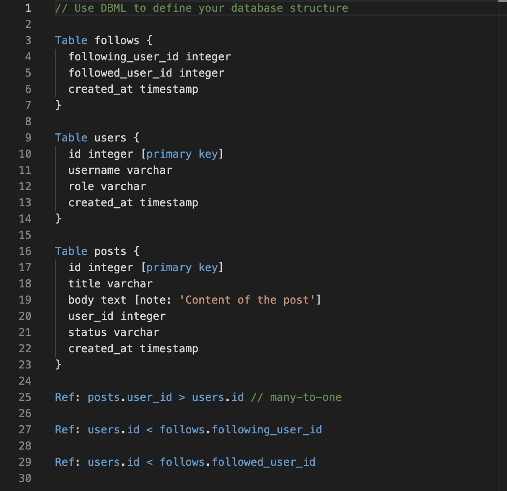

# monaco editor textmate grammar loading example

## [⚡️ Play on Stackblitz](https://stackblitz.com/~/github.com/relliv/monaco-editor-textmate-grammar-loading-example)

## 🌟 Preview

## 📚 References

- [DBML TextMate Schema Source](https://github.com/duynvu/DBML-Highlighter)
- [Collection of TextMate Grammars](https://github.com/shikijs/textmate-grammars-themes)